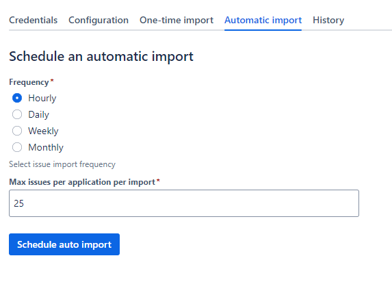
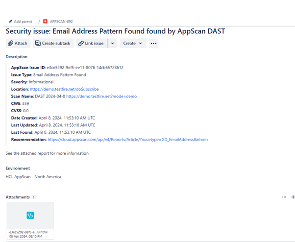
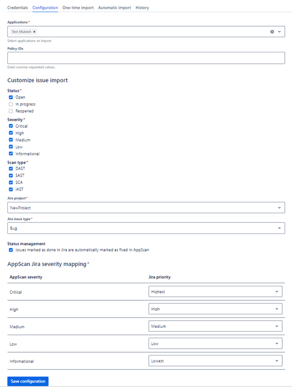

**Marketplace Overview**

**Version Highlights tab:**

**Highlight#1**

**Title:** Automatic Import

**Summary:** Schedule recurring imports based on predefined
frequencies (hourly, daily, weekly, or monthly) and set thresholds for
the maximum number of issues per application.

**Caption:** This helps you to schedule an automatic import.

**Screenshot:**

**Highlight#2**

**Title:** Sample Jira Ticket

**Summary:** The summary includes the scanning technology that
detected the issue. The Description contains the relevant vulnerability
details about the issue.

**Caption:** Sample Jira Ticket

**Screenshot:**

**Highlight#3**

**Title:** Flexible Configuration

**Summary:** Customize import job settings including AppScan
applications, issue state, severity, scan type, target Jira project,
ticket type, and AppScan severity to Jira issue priority mapping. Enable
or disable status management.

**Caption:** This helps you to configure import jobs.

**Screenshot:**

 

### More details

-   This plugin aims to streamline the management of security findings
    from AppScan on Cloud by creating corresponding issues in Jira for
    each imported finding.

-   Filter security vulnerabilities based on issue state, scan type, and
    severity.

-   Supports multiple applications for selective import.

-   Supports ad-hoc one-time import and automatic scheduled import.

-   Recommendation for the issue provided in the description.

-   Mapping of AppScan on Cloud issue severity with Jira ticket
    priority.

-   Import issues as any of the supported Jira ticket types.

-   View the history of import jobs.

-   Supports automatic status management. Issues marked as \"done\" in
    Jira are automatically marked as \"fixed\" in AppScan
